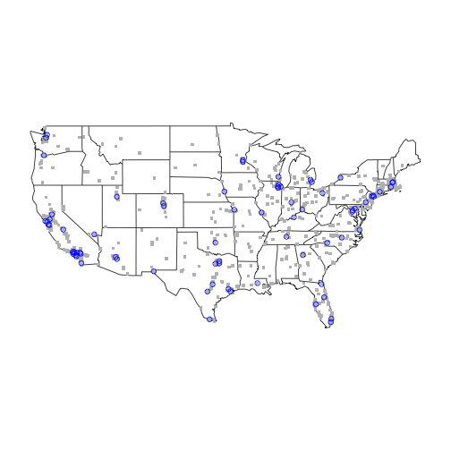

# What If Everyone Lived in the Big City? Round 1

On a recent roadtrip I was driving through rural Alabama and wondered what the country would look like if we emptied out the rural areas and all moved to cities. I'm working on learning R and though this might be a useful exercise to practice with.

## US Cities Data

I'm starting with a small matrix of US cities that will be the basis for a pairwise distance matrix. This is a default data set privided by the maps library. This matrix has 1005 cities and the population sums to 126,175,816. Obviously this list does not have a full tally of the residents in the USA!


```r
head(loc)
```

```
##         pop    long   lat
## [1,] 113888  -99.74 32.45
## [2,] 206634  -81.52 41.08
## [3,]  70069 -122.26 37.77
## [4,]  75510  -84.18 31.58
## [5,]  93576  -73.80 42.67
## [6,]  45535 -123.09 44.62
```

```r
dm <- rdist.earth(loc[, 2:3], loc[, 2:3], miles = TRUE)

# Setup names and zero out small values
rownames(dm) <- name
colnames(dm) <- name
dm[dm[] < 0.1] <- 0

# A sample of the data
dm[1:5, 1:5]
```

```
##            Abilene TX Akron OH Alameda CA Albany GA Albany NY
## Abilene TX        0.0   1169.4       1323     913.8    1579.6
## Akron OH       1169.4      0.0       2169     673.6     412.4
## Alameda CA     1322.7   2169.1          0    2192.6    2546.7
## Albany GA       913.8    673.6       2193       0.0     955.6
## Albany NY      1579.6    412.4       2547     955.6       0.0
```


## How do we move people?

The algoritm is that the following function will select the smallest remaining city and move its population to the closest city.


```r
# pop: Matrix holding population data information. Latest pass is the last column.  dm: Distance matrix pass: Pass number
moveSmallestToClosest <- function(pop, dm, verbose = FALSE) {
    # Find the smallest city in the last column
    smallest <- minindex.nonzero(pop[, ncol(pop)])
    
    # Find the closest city that still has population, other than itself Multiply the vactor of distances from the smallest city by the population of all cities so that emptied out cities are ignored.
    closest <- minindex.nonzero(dm[smallest, ] * pop[, ncol(pop)])
    
    if (verbose) {
        printf("PASS %d: Move %s (%d) to %s (%d) a distance of %f miles", ncol(pop), rownames(dm)[smallest], pop[smallest, 1], rownames(dm)[closest], pop[closest, 1], dm[smallest, closest])
    }
    
    # Record the pass in the pop
    pass <- pop[, ncol(pop)]
    pass[closest] <- pass[closest] + pass[smallest]
    pass[smallest] <- 0
    pop <- cbind(pop, pass)
    
    return(pop)
}
```


Here's an example:


```r
temppop <- pop
temppop <- moveSmallestToClosest(temppop, dm, verbose = TRUE)
```

```
## [1] "PASS 1: Move Montpelier VT (8003) to Augusta ME (18626) a distance of 138.698151 miles"
```


## Move everyone!

Now lets start moving people until every city has over 1 million people.


```r
repeat {
    pop <- moveSmallestToClosest(pop, dm)
    
    # Get the latest pass
    pop.pass <- pop[, ncol(pop)]
    
    # Inspect just the cities that still have population
    pop.pass <- pop.pass[pop.pass > 0]
    smallcities <- length(pop.pass[pop.pass < 1e+06])
    # printf('Small cities remaining: %d', smallcities)
    
    if (smallcities == 0) {
        break
    }
}
```


This completes in 930 passes and we end up with 75 cities:


```r
pop[pop[, ncol(pop)] > 0, c(1, ncol(pop))]
```

```
##                          pop    pass
## Akron OH              206634 1527712
## Antioch CA            109485 1851807
## Arlington Heights IL   74763 1457948
## Arlington VA          184603 1318455
## Atlanta GA            424096 2237859
## Austin TX             683404 1257483
## Baton Rouge LA        222217 2006808
## Bolingbrook IL         76994 1211645
## Buffalo NY            276762 1114043
## Burnsville MN          59357 1001943
## Carmel IN              49188 2322237
## Catonsville MD         43406 1231543
## Chandler AZ           247915 1954314
## Charlotte NC          607111 1624451
## Chicago IL           2830144 2830144
## Cincinnati OH         301561 1588469
## Colton CA              53281 1307698
## Dallas TX            1216543 1945415
## Detroit MI            871789 1477488
## El Paso TX            603545 1400743
## Everett WA             97575 1188433
## Fort Worth TX         633849 2035064
## Franklin TN            51478 1931490
## Fresno CA             472517 1220142
## Garden Grove CA       167647 1421101
## Glendale CA           204747 1814213
## Hawthorne CA           87677 1139967
## Hialeah FL            224644 2192751
## Highlands Ranch CO    109009 1026546
## Houston TX           2043005 2043005
## Irvington NJ           61373 1988483
## Jacksonville FL       809874 1536495
## Kansas City MO        441833 1778917
## Las Vegas NV          553807 1624972
## League City TX         65696 1094194
## Los Angeles CA       3911500 3911500
## Louisville KY         241072 1262351
## Margate FL             55844 1614894
## Milford CT             51360 1844815
## Minneapolis MN        364726 1018306
## Montebello CA          64727 2022951
## Moreno Valley CA      174068 1500871
## Murray UT              56848 1263762
## New York NY          8124427 8124427
## Newport Beach CA       79305 1243189
## Newton MA              84969 1586707
## Norman OK             102925 2033472
## North Bergen NJ        64575 1617498
## Omaha NE              417809 1042287
## Pharr TX               63806 1055381
## Philadelphia PA      1439814 2113449
## Phoenix AZ           1450884 2360650
## Plano TX              260415 2008842
## Pomona CA             157501 1365075
## Pontiac MI             67952 1873717
## Portland OR           542751 1584490
## Providence RI         178295 1360902
## Raleigh NC            350822 1371209
## Sacramento CA         480392 1763244
## Saint Charles MO       62284 1015888
## San Antonio TX       1278171 1278171
## San Diego CA         1299352 1836310
## San Francisco CA      723724 1080342
## San Jose CA           897883 1659259
## San Leandro CA         80015 1581914
## Sanford FL             46777 1050435
## Santa Clara CA        102178 1007150
## Seattle WA            570430 1917372
## Somerville MA          74802 1262307
## Tampa FL              328578 1524310
## Virginia Beach VA     453884 1715976
## West Allis WI          58958 1173867
## Westminster CO        104708 1894406
## Wheaton IL             54365 1230923
## Wheaton-Glenmont MD    61095 1299219
```


## Map

This maps shows each of the original cities as a grey dot. The new cities with over a million residents each are shown as a blue circle:


```r
map("state")
points(loc[, 2], loc[, 3], col = "grey", pch = ".", cex = 5)
points(loc[pop[, ncol(pop)] > 0, 2], loc[pop[, ncol(pop)] > 0, 3], col = "blue")
```

 


## Observations

1. The us.cities data set does not have all of the residents of the United States. Neither does the US State map provided by R. No Alaska or Hawaii much less Puerto Rico and other US territories.
2. 1005 citites isn't a very granular data set for mapping the whereabouts of 313 million people in the US.
3. The cities are not as you would expect. For example there's no Boston but there is a Newton and Somerville, MA that collectively should have been Boston:


```r
pop[c("Newton MA", "Somerville MA"), c(1, ncol(pop))]
```

```
##                 pop    pass
## Newton MA     84969 1586707
## Somerville MA 74802 1262307
```


# References

* http://stackoverflow.com/questions/8509329/finding-nearest-neighbor-between-2-sets-of-dated-points
